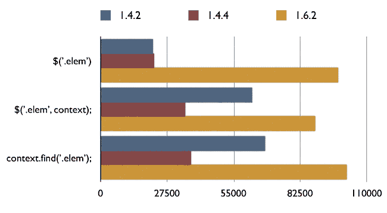

#性能优化
---

###使用最新版本的 JQuery、zepto
最新版本的 JQuery、zepto、zepto 会改进性能和增加新功能，若不是为了兼容旧浏览器，建议使用最新版本的 JQuery、zepto。以下是三条常见的 JQuery 语句，版本越新，性能越好：

分别使用 1.4.2、1.4.4、1.6.2 三个版本测试浏览器在一秒内能够执行多少次，结果 1.6.2 版执行次数远超两个老版本。
>附上官网：[zepto官网](http://zeptojs.com/)、[JQuery全部版本](https://code.jquery.com/jquery/)

###JQuery 变量
1. 存放 jQuery 对象的变量以 $ 开头;
2. 将 jQuery 选择器返回的对象缓存到本地变量中复用；
3. 使用驼峰命名变量；
~~~javascript
var $myDiv = $("#myDiv");
$myDiv.click(function(){...});
~~~

###选择器
1. 尽可能的使用 ID 选择器，因为它会调用浏览器原生方法 document.getElementById 查找元素。当然直接使用原生 document.getElementById 方法性能会更好；
2. 在父元素中选择子元素使用 .find() 方法性能会更好, 因为 ID 选择器没有使用到 Sizzle 选择器引擎来查找元素；
~~~javascript
// not good
var $productIds = $("#products .class");

// good
var $productIds = $("#products").find(".class");
~~~

###DOM 操作
1. 当要操作 DOM 元素的时候，尽量将其分离节点，操作结束后，再插入节点；
2. 使用字符串连接或 array.join 要比 .append()性能更好；
~~~javascript
var $myList = $("#list-container > ul").detach();
//...a lot of complicated things on $myList
$myList.appendTo("#list-container");

// not good
var $myList = $("#list");
for(var i = 0; i < 10000; i++){
    $myList.append("<li>"+i+"</li>");
}

// good
var $myList = $("#list");
var list = "";
for(var i = 0; i < 10000; i++){
    list += "<li>"+i+"</li>";
}
$myList.html(list);

// much to good
var array = [];
for(var i = 0; i < 10000; i++){
    array[i] = "<li>"+i+"</li>";
}
$myList.html(array.join(''));
~~~

###事件
1. 如果需要，对事件使用自定义的 namespace，这样容易解绑特定的事件，而不会影响到此 DOM 元素的其他事件监听；
2. 对 Ajax 加载的 DOM 元素绑定事件时尽量使用事件委托。事件委托允许在父元素绑定事件，子代元素可以响应事件，也包括 Ajax 加载后添加的子代元素；
~~~javascript
$("#myLink").on("click.mySpecialClick", myEventHandler);
$("#myLink").unbind("click.mySpecialClick");

// not good
$("#list a").on("click", myClickHandler);

// good
$("#list").on("click", "a", myClickHandler);
~~~

###链式写法
1. 尽量使用链式写法而不是用变量缓存或者多次调用选择器方法；
2. 当链式写法超过三次或者因为事件绑定变得复杂后，使用换行和缩进保持代码可读性；
~~~javascript
$("#myDiv").addClass("error").show();

$("#myLink")
  .addClass("bold")
  .on("click", myClickHandler)
  .on("mouseover", myMouseOverHandler)
  .show();
~~~

###JQuery、zepto其他
1. 多个参数使用对象字面量存储；
2. 不要将 CSS 写在 jQuery 里面；
3. 正则表达式仅准用 .test() 和 .exec() 。不准用 "string".match() ；

###避免不必要的 DOM 操作
浏览器遍历 DOM 元素的代价是昂贵的。最简单优化 DOM 树查询的方案是，当一个元素出现多次时，将它保存在一个变量中，就避免多次查询 DOM 树了。

~~~javascript
// good
var myList = "";
var myListHTML = document.getElementById("myList").innerHTML;

for (var i = 0; i < 100; i++) {
  myList += "" + i + "";
}

myListHTML = myList;

// not good
for (var i = 0; i < 100; i++) {
  document.getElementById("myList").innerHTML += "" + i + "";
}
~~~

###缓存数组长度
循环无疑是和 JavaScript 性能非常相关的一部分。通过存储数组的长度，可以有效避免每次循环重新计算。

注: 虽然现代浏览器引擎会自动优化这个过程，但是不要忘记还有旧的浏览器。
~~~javascript
var arr = new Array(1000),
    len, i;
// good - size is calculated only 1 time and then stored
for (i = 0, len = arr.length; i < len; i++) {

}

// not good - size needs to be recalculated 1000 times
for (i = 0; i < arr.length; i++) {

}
~~~

###异步加载第三方内容
当你无法保证嵌入第三方内容比如 Youtube 视频或者一个 like/tweet 按钮可以正常工作的时候，你需要考虑用异步加载这些代码，避免阻塞整个页面加载。

~~~javascript
/* url为js的链接，callBack为url的js中的函数（该函数调用应该写到匿名函数中，如function(){console.log(div.getScrollOffset())}）*/
function asyncLoaded(url,callBack){
    var script = document.createElement('script');
    script.type = 'text/javascript';
    /* if else 这几句话必须要写到这位置处，不能放最后，因为if中js加载中script.readyState存在好几种状态，
    只有状态改变‘readystatechange’事件才会触发，但现在浏览器加载速度很快，当解析到该事件时JS有可能以加载完，
    所以事件根本不会触发，所以要写到前面*/
    if(script.readystate){//兼容IE
        script.onreadystatechange = function() {//状态改变事件才触发
            if(script.readyState == 'loaded' || script.readyState == 'complete'){    
                callBack();
                script.onreadystatechange = null;        
            }
        }
    }else{
        script.onload = function(e){
            callBack();
        }
    }        
    script.src = url;
    document.body.appendChild(script);
}
~~~

###避免使用 jQuery 实现动画
1. 禁止使用 slideUp/Down() fadeIn/fadeOut() 等方法；
2. 尽量不使用 animate() 方法；
3. 对于移动端浏览器，尽量使用CSS3动画或者canvas

