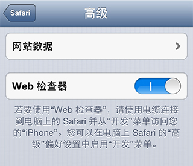
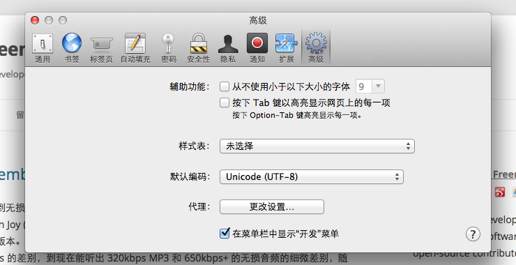
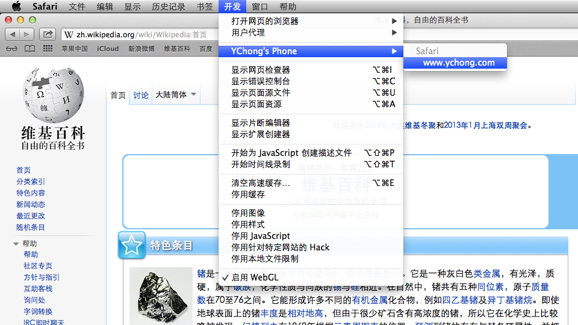
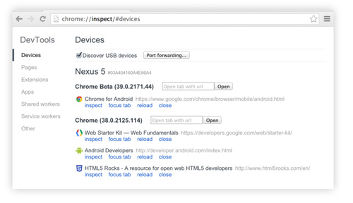
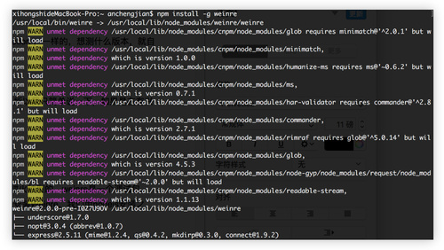
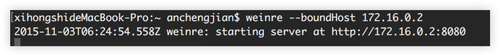
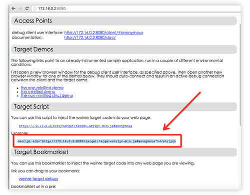
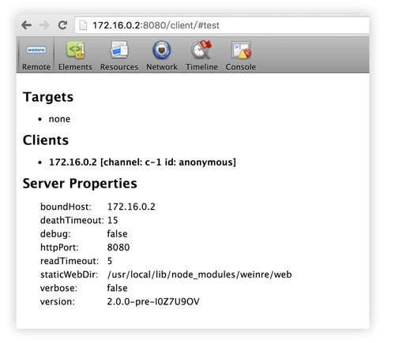

#代码调试与兼容性测试
---
对于移动端，调试代码一直是一个比较麻烦的问题，现在常用的调试方式，有以下几种：

对于纯前端的代码，可以在浏览器进行模拟开发，调试还是比较方便的。但是部分机型定位问题需要真机定位，有什么好的办法了。

**对于部分需要真机调试有没有什么好的办法了？？**

####1. IOS 移动端 （Safari开发者工具）

手机端：设置 → Safari → 高级 → Web 检查器 → 开。

mac端：Safari → 偏好设置 → 高级 → 在菜单栏中显示“开发”菜单。

在 OS X 中启动 Safari 之后，以 USB 电缆正常接入 iOS 设备，并在此移动设备上启动 Safari。此时点击计算机上的 Safari 菜单中的“开发”，可以看到有 iOS 设备的名称显示，其子菜单项即为移动设备上 Safari 的所有标签页，点击任意一个开始调试。

---

 
####2. 安卓移动端
* **chrome 调试方法**

首先确保手机上和PC机上装有最新版本的chrome浏览器，其次是将手机的开发者选项打开并允许调试，然后将数据线将两台设备连接起来。在PC机上打开chorme，输入chrome://inspect ，然后在手机上打开chrome，然后手机会弹框询问是否允许调试，当然确定啦。有时候手机锁屏会断开，请拔掉usb重来。

点击inspect打开DevTools后，你可以选中页面中的DOM元素，同时设备中对应元素也高亮显示，也可使用DevTools中的Inspect Element 选中目标元素，可以实时与移动设备页面交互，方便的定位问题所在，进行代码调试，就能像pc端一样愉快的玩耍了。如果有问题，请检查chrome版本。

chrome的调试一般只可以调试chrome页面，但是其官方文档说还可以调试WebViews：

“On your computer, the chrome://inspect page displays every connected device, along with its open tabs and debug-enabled WebViews.”

需要说明调试WebView需要满足安卓系统版本为Android 4.4+，并且需要再你的APP内配置相应的代码，在WebView类中调用静态方法setWebContentsDebuggingEnabled，如下：

~~~javascript
if (Build.VERSION.SDK_INT >=Build.VERSION_CODES.KITKAT) {  
   WebView.setWebContentsDebuggingEnabled(true);  
}
~~~

以上配置方法适用于安卓应用内所有的WebView情形。

安卓WebView是否可调试并不取决于应用中manifest的标志变量debuggable，如果你想只在debuggable为true时候允许WebView远程调试，请使用以下代码段：
~~~javascript
if (Build.VERSION.SDK_INT>= Build.VERSION_CODES.KITKAT) { 
    if (0 != (getApplicationInfo().flags &=ApplicationInfo.FLAG_DEBUGGABLE{
        WebView.setWebContentsDebuggingEnabled(true);
    }
}
~~~

我这里只写了个大概，如果有其他问题或者欲查看详细文档，看下面链接（自备梯子）：

https://developer.chrome.com/devtools/docs/remote-debugging

注意：同样的你也可以在电脑上装安卓的虚拟机，推荐[Genymotion](http://www.genymotion.net/) ，一样的，想测什么版本，就自己下rom ，当然土豪当我没说。
 
* **UC开发者浏览器**

由于不推荐移动端使用UC，所以我只简单说一下，如果是在有兴趣，请自行查看： http://plus.uc.cn/document/webapp/doc5.html

它的调试方法与chrome差异不大。

 
 
###客户端调试
最麻烦的还是调试客户端代码以及基于微信开发的代码（现在微信已经有了web开发者工具：[微信web开发者工具](https://mp.weixin.qq.com/wiki/10/e5f772f4521da17fa0d7304f68b97d7e.html)）

那么对于客户端方式有什么好的办法了？？

 
####alert方式：
这是最low的方式，却也是最有效的方法，通过不断的alert，最后找到出错的代码位置。
 
####利用JS原生的捕获代码：

* 利用window.onerror方法
~~~javascript
window.onerror = function(errorMessage,scriptURI,lineNumber,columnNumber,error) {
    alert( "真不幸，又出错了\n"
        + "\n错误信息：" + errorMessage
        + "\n所在文件：" + scriptURI
        + "\n错误行号：" + lineNumber
        + "\n错误列号：" + columnNumber
    );
};
~~~

* 利用try-catch方法
将可能报错的代码放入try代码块中，如果报错，就在catch中捕获错误
~~~javascript
try {
  // 在这里运行代码
}
catch(err) {
  // 在这里捕获并处理错误
}
~~~
 
####利用Rosin插件
利用Fiddler抓包，并通过Rosin获取调试信息
Rosin是一个Fiddler插件，协助开发者进行移动端页面开发调试，是移动端web开发、调试利器。
具体使用方法见插件地址：http://alloyteam.github.io/Rosin/

 
####利用vConsole调试面板
vConsole 是一个网页前端调试面板，专为手机 web 页面量身设计，帮助开发者更为便捷地进行开发调试工作。

具体使用方法见插件地址：https://github.com/WechatFE/vConsole

 
####使用 Weinre 调试
该方法是比较老的一种方法，对于其他的调试方法来说属于刀耕火种型的。weinre是一个调试包，本身提供一个JavaScript，需要你在项目文件中加入该js。首先安装Weinre，我们用nodejs安装之，使用-g全局命令，以便可以在各个目录下访问：

>npm install -g weinre

安装weinre之后再设置监听本机的ip:

> weinre --boundHost xxxxxxxxxxx

然后打开返回的地址的说明文档，然后把返回的js写入到调试的文档中，注意我箭头所指向的地方。

这样访问页面的时候，加载这个 JS，就会被 Weinre 监听到进行控制。

小提示：这个 JS 后面的 #anonymous 起到一个标识作用，为了区别，我们可以将其修改成 #test 放到页面中。这时候，我们的 Inspect 面板的地址就不是 http://172.16.0.2:8080/client/#anonymous 了，而是 http://172.16.0.2:8080/client/#test 。

当我们访问页面的时候，就会出现在监听列表中，如果有多个网页，你可以从列表中选择一个。然后就可以使用后面的 Elements、Console 等面板来进行调试操作了：

Weinre 非常灵活，只需要在页面中加载这个 JS，然后访问即可，因此 WebView 可以用这种方法调试，一些低版本的 Android、iOS 也可以支持，Window Phone 也是可以用的。在调试移动设备时你可能需要在本地搭建一个局域网 IP 的服务器，将设备与本机网络连接成一个局域网，用移动设备访问这个网页即可。

当然 Weinre 也不是万能的，相比 Chrome 的调试工具，它缺少 JavaScript debug 以及 Profiles 等常用功能，但是它兼容性强，可以实现基础调试功能。

