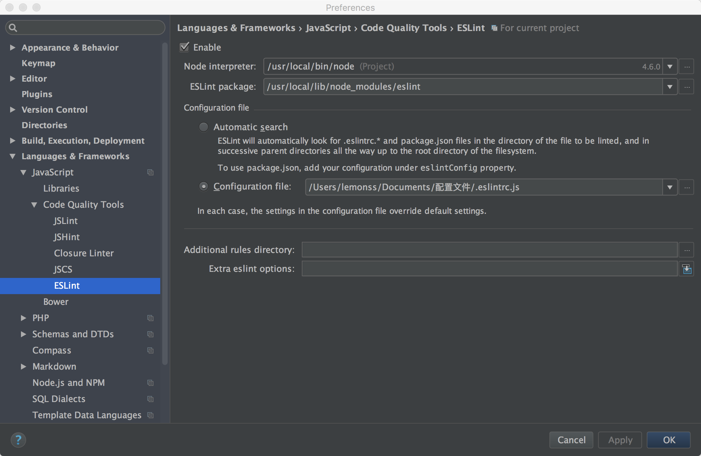

1. 安装node包
    * eslint `npm install eslint -g`
    * csscomb `npm install csscomb -g`
    * csslint `npm install csslint -g`
    * sass-lint `npm install sass-lint -g`

2. 安装sublime3 [Package Control](https://packagecontrol.io/installation#st3)
    * 按下 ctrl+`
    * 复制粘贴以下代码 
    import urllib.request,os,hashlib; h = 'eb2297e1a458f27d836c04bb0cbaf282' + 'd0e7a3098092775ccb37ca9d6b2e4b7d'; pf = 'Package Control.sublime-package'; ipp = sublime.installed_packages_path(); urllib.request.install_opener( urllib.request.build_opener( urllib.request.ProxyHandler()) ); by = urllib.request.urlopen( 'http://packagecontrol.io/' + pf.replace(' ', '%20')).read(); dh = hashlib.sha256(by).hexdigest(); print('Error validating download (got %s instead of %s), please try manual install' % (dh, h)) if dh != h else open(os.path.join( ipp, pf), 'wb' ).write(by)

3. 安装sublime3插件
	* 按下 `ctrl+shift+p`，输入'ip'（Install Package）
    * 输入以下插件的名字，按顺序逐个进行安装：
    	* `Sass`
        * `SublimeLinter`
        * `SublimeLinter-contrib-eslint`
        * `SublimeLinter-contrib-sass-lint`
        * `SublimeLinter-csslint`
        * `DocBlockr`
        
4. 插件的配置文件
将以下配置文件分别下载后放入项目根目录下：
	* `ESLint` [配置文件](http://static.zhangyoubao.com/config/.eslintrc.js)
	* `CSSLint` [配置文件](http://static.zhangyoubao.com/config/csslintrc)
	* `SCSS-Lint` [配置文件](http://static.zhangyoubao.com/config/scss-lint.yml)
    
###phpstrom配置

phpstrom中自带了eslint插件，只需要启用并选择配置文件即可

